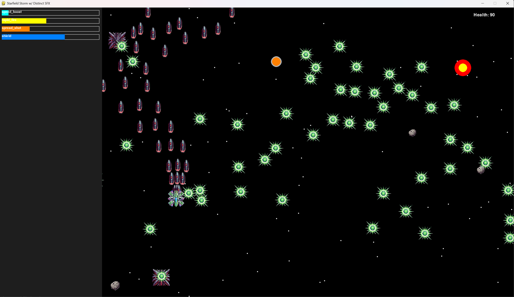

# Starfield Storm

A fast-paced space shooter built with Pygame, featuring power-ups, enemy waves, and an evolving difficulty system.

## Screenshot

See the game in action:



## Features

- **Dynamic Difficulty Scaling**: The game increases difficulty over time with faster and more numerous enemies.
- **Power-ups & Pickups**: Collect power-ups to enhance fire rate, movement speed, or gain a shield.
- **Diverse Enemy Types**: Different enemy ships with varied attack patterns.
- **Configurable Game Settings**: Easily modify game settings through `settings.json`.
- **Starfield Effect**: A scrolling background of stars for an immersive space experience.
- **Sound Effects & Music**: Customizable sound and music system with distinct effects.

## Installation

### Requirements

- Python 3.x
- Pygame (`pip install pygame`)

### Setup

1. Clone the repository:
   ```sh
   git clone https://github.com/your-username/starfield-storm.git
   cd starfield-storm
   ```
2. Install dependencies:
   ```sh
   pip install -r requirements.txt
   ```
3. Run the game:
   ```sh
   python game.py
   ```

## Controls

- **Mouse Movement**: Move the player ship.
- **Left Click**: Shoot.
- **Spacebar**: Start game from the menu.
- **R**: Restart after game over.
- **Q**: Quit the game.

## Configuration

Modify `settings.json` to customize game settings like:

- Window size and FPS
- Player attributes (speed, fire rate, health, etc.)
- Enemy spawn rates and behavior
- Power-up types and rarity
- Audio settings (background music, sound effects)

